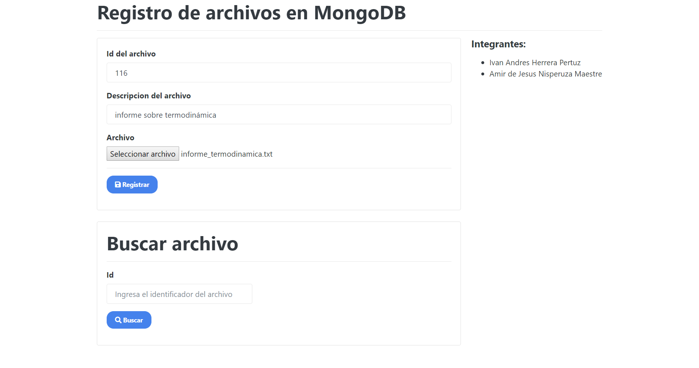
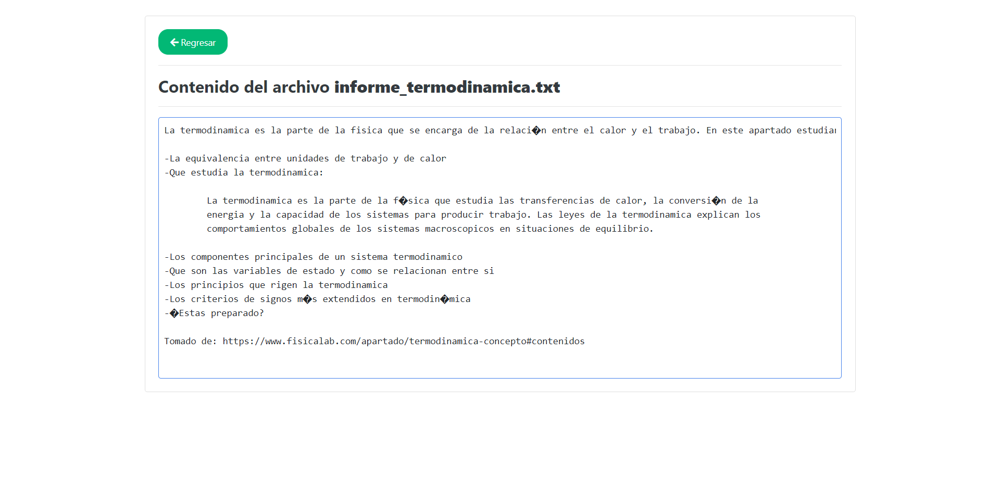

# CRUD-PHP-MongoDB
Registro de archivos binarios (.txt) en una base de datos NoSQL como MongoDB, unido al backend en PHP

#### Tecnologias usadas:
- PHP
- MongoDB
- Bootstrap
- HTML

#### Capturas

- Screencapture del index.html (Pagina principal)

- Screencapture de guardar.php (Notificacion de que se guardo el archivo)

- Screencapture de buscar.php (Pagina para visualizar el contenido del archivo)

